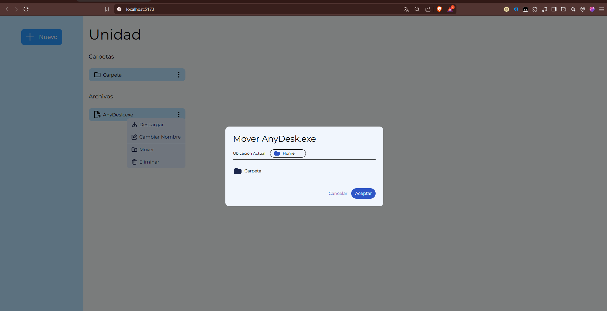

# Proyecto de Drive 🚗💾

Este es un proyecto hecho con **React + NestJS + TypeScript + Docker**.

## 📸 Capturas de Pantalla

### 🌐 Interfaz


---

### 🔥 Modales




---

### 📌 Dropdown


---

## 🛠️ Tecnologías Usadas

1. React
2. TailwindCSS
3. Vite.js
4. NestJS
5. Docker

---

## ⚙️ Instalación

### Vía Docker

1. Clonar el repositorio:

   ```bash
   git clone https://github.com/Laszlo-Caballero/DriveV2
   ```

2. Configurar el archivo `.env`. Solo debe modificar la variable `PATH_DRIVE` con la ruta adecuada.

3. Construir y levantar los contenedores:

   ```bash
   docker-compose up --build
   ```

4. Acceder a la aplicación en: `http://localhost:8000`

5. Si quiere acceder desde otro dispositivo `http://YOUR_IP:8000`

### Via local

1. Clonar el repositorio:

   ```bash
   git clone https://github.com/Laszlo-Caballero/DriveV2
   ```

2. Configurar todos los .env de los folders

3. Instalar las dependencias:
   ```bash
       npm install
   ```
4. ejecutar los proyectos

   - Para el FrontEnd
     ```bash
         npm run dev
     ```
   - Para el BackEnd
     ```bash
         npm run start:dev
     ```
